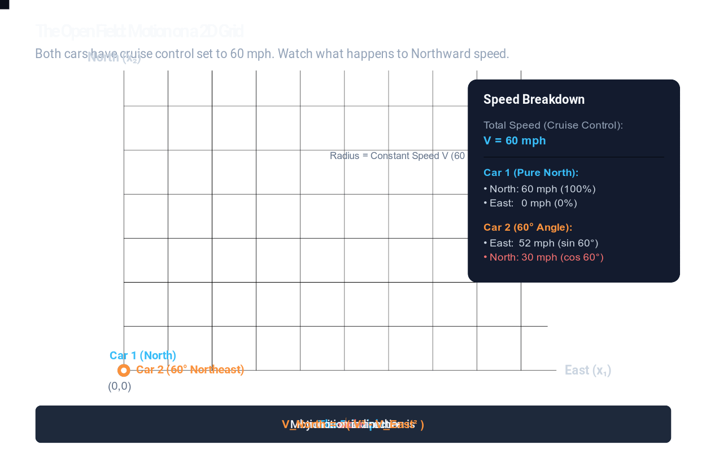
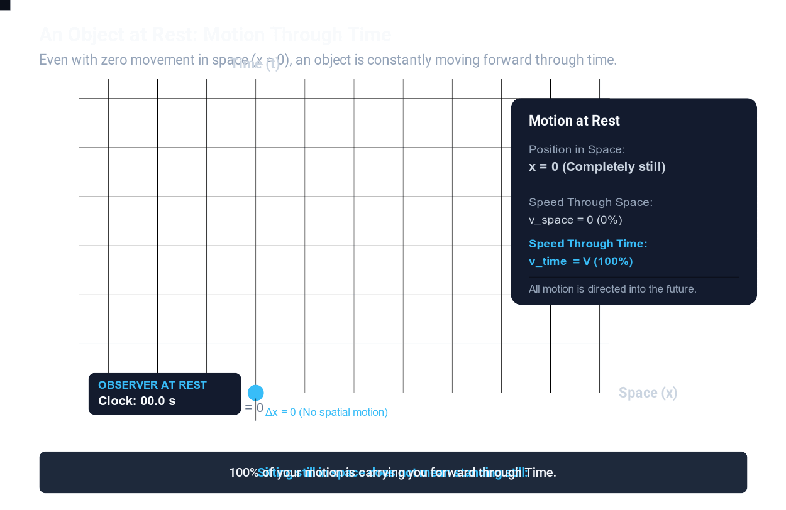
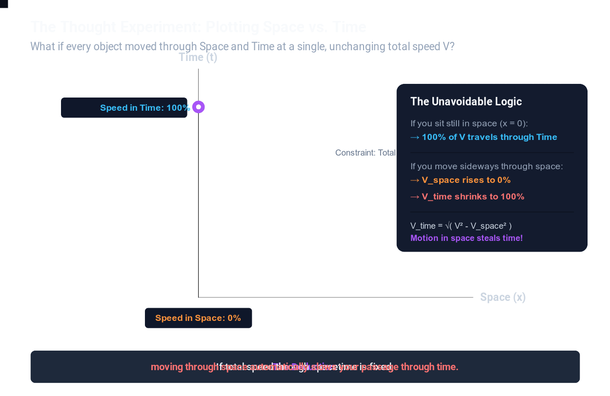
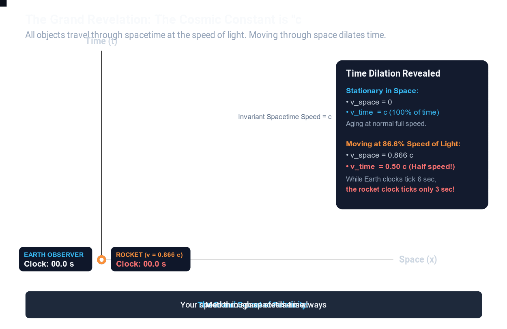
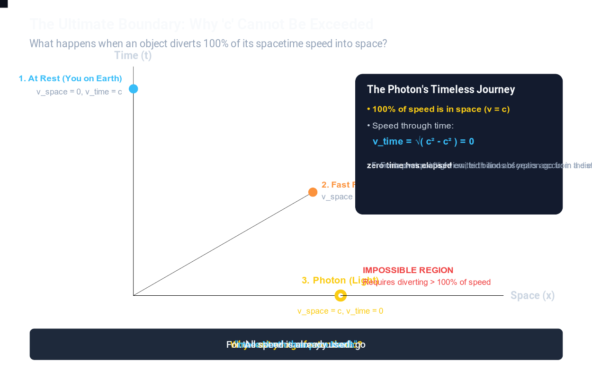

# An Intuitive Look at Special Relativity: Why Motion Through Space Affects Time

*Part 1 of a visual, step-by-step exploration of Special and General Relativity.*

---

When many of us first encounter Albert Einstein’s Special Theory of Relativity, it often arrives wrapped in abstract thought experiments: high-speed trains flashing light pulses at platforms, mirrors bouncing photons up and down, and algebraic formulas filled with square roots. 

While these classic explanations are mathematically rigorous, they can sometimes leave a curious reader feeling ungrounded. We might follow the steps on paper, but we are still left wondering: *Why should moving through space have anything to do with how fast a clock ticks? What is the underlying physical intuition that connects space and time?*

Our goal in this series is to set aside the abstract formulas and build an intuitive understanding from the ground up. By starting with a familiar scenario that anyone can visualize on a flat surface, we can follow a natural chain of geometric reasoning that leads directly to the core insights of relativity: why moving clocks run slow, why the speed of light is a natural cosmic limit, and how we all experience spacetime in our daily lives.

Let’s begin with a simple observation on a flat plane.

---

## 1. Starting with Simple Geometry: Two Cars on a 2D Plane

Imagine a broad, flat open field. We draw a standard coordinate grid on the ground with two perpendicular directions: **East** (which we will call $x_1$) and **North** (which we will call $x_2$).

At the starting point $(0,0)$, we place two cars: a **Blue Car** and an **Orange Car**.

Both drivers turn on cruise control, locking their speed to the exact same value: **60 miles per hour** ($V = 60\text{ mph}$). Neither vehicle can speed up, and neither can slow down. 

Now they begin driving:

1. **The Blue Car** points its wheels due **North** along the $x_2$ axis. Because all of its motion is directed North, its Northward speed is $60\text{ mph}$, and its Eastward speed is $0\text{ mph}$.
2. **The Orange Car** chooses a different path. It angles its heading $60^\circ$ toward the **East** (away from North) along a diagonal.

Consider a simple question: **After driving for an hour, will the Orange Car be at the same Northward position as the Blue Car?**

Intuitively, we know it will not. 

Because the Orange Car angled toward the East, its fixed $60\text{ mph}$ speed is now shared between two perpendicular directions. We can see exactly how that speed is split by looking at the right triangle formed by its heading:

- **Speed Eastward ($x_1$):**  
  The Eastward component depends on the sine of the angle:  
  $$V_{\text{East}} = V \times \sin(60^\circ) = 60 \times \frac{\sqrt{3}}{2} \approx 60 \times 0.866 \approx 52\text{ mph}$$

- **Speed Northward ($x_2$):**  
  The Northward component depends on the cosine of the angle:  
  $$V_{\text{North}} = V \times \cos(60^\circ) = 60 \times 0.5 = 30\text{ mph}$$

Notice where that $52\text{ mph}$ comes from: because $\sin(60^\circ) \approx 0.866$, the car directs about $86.6\%$ of its speed toward the East. And because $\cos(60^\circ) = 0.5$, its progress Northward is cut exactly in half, down to $30\text{ mph}$.

By the Pythagorean theorem, these two perpendicular speeds always combine back to the fixed total speed:

$$V_{\text{North}}^2 + V_{\text{East}}^2 = V^2$$

$$30^2 + 52^2 \approx 900 + 2704 \approx 3600 = 60^2$$

If we want to know how much Northward speed remains after dedicating some speed Eastward, we simply rearrange the formula:

$$V_{\text{North}} = \sqrt{V^2 - V_{\text{East}}^2}$$

$$V_{\text{North}} = \sqrt{60^2 - 52^2} = 30\text{ mph}$$

The car’s engine didn't slow down; it maintained a full $60\text{ mph}$ the entire time. Rather, because part of its total speed was dedicated to moving East, less speed was available to move North. 

> **A Key Geometric Observation:**  
> When total speed is fixed, **motion in one direction naturally trades off against motion in a perpendicular direction.**

This observation is straightforward, almost self-evident. Yet, as we will see, it provides the exact mental model needed to understand relativity.

---

## 2. Treating Time as an Axis

Now, let us take this geometric idea and make a simple shift in how we picture the world.

Suppose we draw another 2D grid. We will keep the horizontal axis as **Space** ($x$), representing motion to the left or right. 

For the vertical axis, instead of labeling it "North," let’s label it **Time** ($t$).

What does it mean to move along this vertical axis?

Consider yourself sitting in a chair right now. You may be completely motionless relative to your room; your speed through space is zero. 

Yet, are you standing still in time? 

Clearly not. Each second that passes on your watch carries you steadily forward into the future. Even when you are stationary in space, you are constantly progressing along the Time axis.

This simple diagram reveals an important baseline: to exist is to move through time. An object sitting completely still at $x = 0$ is not static; it is traveling forward along the vertical Time axis.

---

## 3. The Thought Experiment: A Fixed Speed Through Spacetime

Now that we have a plane with Space on one axis and Time on the other, let us pose a hypothetical question:

What if nature operated under a single, elegant geometric rule—namely, that every object in existence moves through this combined Space-Time plane at a **single, constant total speed, $V$**?

Let’s trace what such a rule would require.

### An Observer at Rest
If an observer sits completely still in space, their spatial velocity is zero ($v_{\text{space}} = 0$). 
Since their total speed vector has a constant length $V$, the entire vector must point straight up along the Time axis:

$$v_{\text{time}} = V$$

All of their motion is directed through time. Their clock ticks forward at its full, normal rate.

### An Observer Moving Through Space
Now, suppose this person begins moving across space at a speed $v_{\text{space}}$.

If their total speed vector through spacetime is fixed at length $V$, look at what happens as that vector tilts into the space dimension. 

The vertical component along the Time axis **must become shorter**.

Just like the car in our first example, the traveler cannot create extra speed. If part of their fixed speed vector is dedicated to moving through Space, that motion must be drawn from their motion through Time:

$$v_{\text{time}} = \sqrt{V^2 - v_{\text{space}}^2}$$

Under this hypothetical rule, we arrive at an inevitable conclusion without touching any advanced physics: **the moment an object begins moving through space, its rate of progress through time must decrease.**

Motion through space trades off against motion through time.

---

## 4. Connecting to the Real World: The Cosmic Constant $c$

This thought experiment might seem like a neat mathematical curiosity. But what makes it so fascinating is that **this is remarkably close to how our physical universe actually works.**

When Albert Einstein formulated Special Relativity in 1905, and Hermann Minkowski subsequently revealed its geometric structure, they showed that space and time are fundamentally woven into a single four-dimensional continuum: **spacetime**.

And what is that constant speed $V$ that governs motion through spacetime?

It is the constant denoted by **$c$**—commonly known as the speed of light (approximately $299,792\text{ km/s}$, or $671\text{ million miles per hour}$).

In this geometric view:
- When you are sitting at rest in your chair, your motion is directed almost entirely through time at speed $c$. Your watch ticks at its standard rate.
- If a traveler boards a spacecraft and travels through space at a significant fraction of light speed—say, $86.6\%$ of $c$ ($v_{\text{space}} = 0.866c$, directly mirroring the $\sin(60^\circ)$ angle from our car example)—they are directing a substantial portion of their spacetime velocity into space.

How much of their motion remains along the time dimension?

$$v_{\text{time}} = \sqrt{c^2 - v_{\text{space}}^2} = \sqrt{c^2 - (0.866c)^2} = \sqrt{0.25c^2} = 0.50c$$

Their progress through time is reduced to half its normal rate. 

While six seconds elapse for an observer on Earth, only three seconds elapse on the traveler’s watch. To the traveler inside the spacecraft, everything appears completely normal—their heart beats, their thoughts flow, and their clocks tick in perfect rhythm with their body. But when compared to the stationary observer, the traveler has aged more slowly.

This effect is known as **Time Dilation**. It is not a mechanical defect in clocks or an optical trick of delayed signals; it is a direct consequence of how motion is distributed between space and time.

---

## 5. Natural Consequences: The Speed Limit and Timeless Light

Once we view spacetime through this geometric lens, several famous features of relativity emerge naturally from the geometry.

### Why is the Speed of Light an Unbreakable Limit?
It is often stated that nothing can exceed the speed of light. People often wonder: *Why? Could a sufficiently advanced propulsion system eventually push an object past this barrier?*

Consider what happens if an object directs 100% of its spacetime speed into space:

If an object travels through space at $v_{\text{space}} = c$, how much speed remains for time?

$$v_{\text{time}} = \sqrt{c^2 - c^2} = 0$$

Its motion through time drops to zero. 

Just as a car on a 2D plane cannot travel "more than 100% East," an object cannot divert more than all of its speed into space. To exceed $c$ would require having more total motion than nature provides. The speed of light is not an arbitrary barrier; it is simply the full magnitude of motion available in spacetime.

### The Timeless Experience of Light
Because light (composed of photons) travels through space at speed $c$, it has zero remaining speed through time:

$$v_{\text{time}} = 0$$

This leads to a remarkable conclusion: **from the perspective of light itself, time does not pass.** 

A photon emitted by a distant star may travel across billions of light-years of expanding space to reach a telescope on Earth. While billions of years have passed according to our clocks, for the photon, emission and absorption occur in the exact same instant.

### Why Don’t We Notice This in Daily Life?
If moving through space reduces our progress through time, why doesn't our watch fall behind when we take a long drive or an airplane flight?

The reason comes down to the immense magnitude of $c$. 

Light travels at roughly $1,080,000,000\text{ km/h}$. When you sit in a commercial airplane cruising at $900\text{ km/h}$, your speed through space as a fraction of light speed is:

$$\frac{v}{c} \approx \frac{900}{1,080,000,000} \approx 0.00000083$$

Plugging this tiny ratio into our equation shows that the reduction in your motion through time is less than a few nanoseconds over an entire flight. 

Human life takes place in an extreme low-speed environment compared to the speed of light. Because all of us are moving through space at nearly zero compared to $c$, we all share almost exactly the same rate of passage through time. It is only natural that humanity spent centuries assuming time was absolute and identical for everyone.

---

## 6. Curious Questions: What Can We Actually Do With This?

Once this geometric picture clicks, it naturally stirs up questions about how time behaves in extreme situations. Let’s explore a few imaginative scenarios that physics allows us to contemplate.

### Can You Speed Up or Slow Down Time?
If motion through space trades off against motion through time, can you use this to your advantage?

- **How to slow down your own time (and leap into the future):**  
  If you want to travel into Earth's distant future, the recipe is straightforward in theory: build a spacecraft capable of traveling at $99.99\%$ of the speed of light. Because nearly all of your spacetime velocity is dedicated to moving through space, your progress through time slows to a crawl relative to people on Earth. For every day that passes for you aboard the ship, roughly 70 days elapse on Earth. Spend a year cruising the cosmos at this speed, and when you return, you will have aged just one year while Earth has advanced by 70 years. You cannot travel backward into the past, but one-way travel into the future is a built-in feature of our universe.

- **Can you speed up your time?**  
  Looking back at our diagram, an interesting limitation reveals itself: you can never travel through time *faster* than $c$. When sitting completely at rest in space, you are already pointing $100\%$ of your vector into time ($v_{\text{time}} = c$). Moving in any direction in space can only *reduce* your speed through time, never increase it. In flat spacetime, you are already experiencing time at the maximum speed nature permits.

### Nature's Built-in Demonstration: Atmospheric Muons
Nature even provides a direct, observable demonstration of this geometry right above our heads.

When high-energy cosmic rays from deep space strike the upper atmosphere—about 10 kilometers above the ground—they create unstable subatomic particles called **muons**. 

In laboratory experiments, a muon decays in just 2.2 millionths of a second (2.2 microseconds). Even if a muon traveled at nearly the speed of light, simple arithmetic suggests it could travel at most about 660 meters before vanishing:

$$\text{Distance} = \text{Speed} \times \text{Lifetime} \approx (300,000\text{ km/s}) \times (0.0000022\text{ s}) \approx 0.66\text{ km}$$

Starting 10 kilometers up, virtually no muons should survive to reach sea level.

Yet, particle detectors on the Earth's surface detect millions of muons every single day. Why? 

Because these muons travel downward at about $99.9\%$ of the speed of light ($0.999c$). Just like the Orange Car in our opening example, muons divert almost all of their spacetime motion into space. From our vantage point on Earth, their internal clocks tick about 22 times slower than normal. That fleeting 2.2 microseconds stretches out into nearly 50 microseconds—giving them plenty of time to complete their journey to the ground.

---

## Looking Ahead: Questions for Part 2

By taking a geometric approach, we have established a foundational mental model:
1. Objects have a fixed total capacity for motion through spacetime, bounded by $c$.
2. An object at rest moves primarily through time.
3. Moving through space diverts motion away from time, causing clocks to slow down (time dilation).
4. Directing all motion into space leaves zero motion for time, which is why $c$ is the natural speed limit and why photons experience no elapsed time.

This raises a subtle and fascinating question:

If all motion is relative, what happens when two spacecraft drift past each other in deep space? 

From astronaut A’s point of view, astronaut B is moving, so B’s clock should be running slow. But from astronaut B’s perspective, A is moving, so A’s clock should be running slow. 

Can both observers be correct? If they turn around and meet again, who is actually younger?

In **Part 2**, we will explore this puzzle, diving into the famous **Twin Paradox**, the **Relativity of Simultaneity**, and why the concept of "at the same time" is far more flexible than our everyday intuition suggests.

---

*Thank you for reading. If you enjoyed this visual exploration, feel free to share it with fellow curious minds, and stay tuned for the next installment in the series.*
